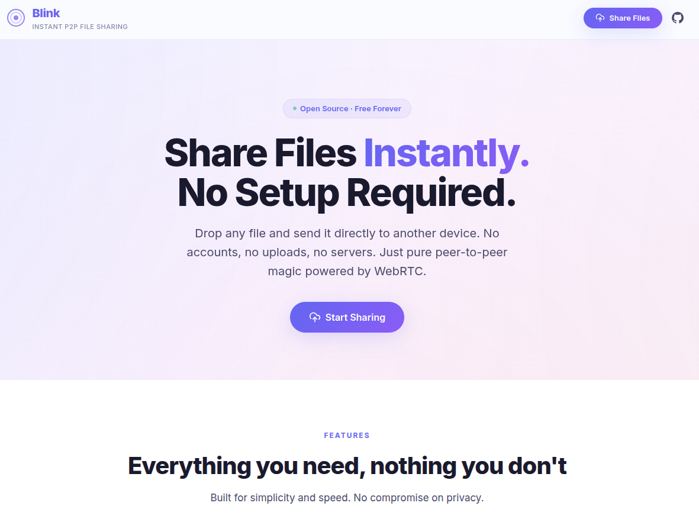
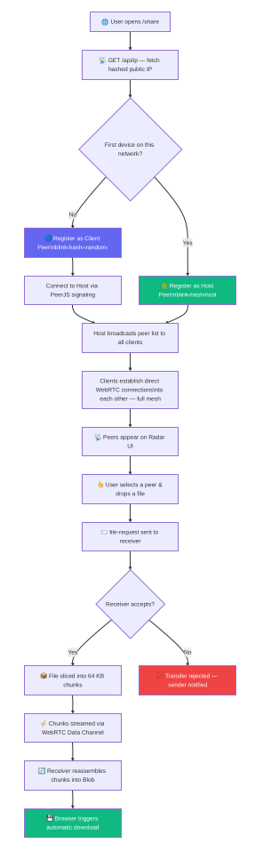

# Blink

A serverless, peer-to-peer instant file-sharing web app. Zero setup. Zero sign-up.



- **Blink** is an open-source, serverless file-sharing tool that lets you send any file directly from one browser to another — instantly and privately. 

- No accounts, no uploads to the cloud, no app installs. It works entirely over **WebRTC**, meaning your files travel directly between devices and never touch a server. 

- Just open Blink on two devices connected to the same Wi-Fi network, and start sharing.

## 📑 Table of Contents

- [Features](#features)
- [Tech Stack](#tech-stack)
- [Directory Structure](#directory-structure)
- [How It Works](#how-it-works)
- [How to Use](#how-to-use)
- [Getting Started](#getting-started)
- [Contributing](#contributing)


## ✨ Features

| Feature | Description |
|---|---|
| 🔒 **End-to-End Private** | Files transfer directly between browsers via WebRTC Data Channels. Your data never touches any server. |
| ⚡ **Blazing Fast** | Direct peer-to-peer connections transfer files at the maximum speed your local network allows. |
| 📂 **Any File Format** | Send PDF, PNG, JPG, GIF, ZIP, MP4, or literally any file type — no restrictions, no compression. |
| 📡 **Auto Discovery** | Devices on the same Wi-Fi network are automatically discovered using a hashed public IP. No manual pairing needed. |
| ✨ **Zero Setup** | No accounts, no downloads, no room codes. Just open the page in your browser and start sharing. |
| 📱 **Works Everywhere** | Fully responsive — works seamlessly on desktop, tablet, and mobile browsers. |
| 🎯 **Radar UI** | A modern animated radar interface shows nearby peers in real time with device-type icons. |
| 📦 **Chunked Transfer** | Large files are handled gracefully with 64 KB chunking (`File.slice` + `ArrayBuffer`) for reliable delivery. |
| 📊 **Progress Indicators** | Circular and linear progress bars with live transfer speed and ETA. |
| 🖱️ **Drag & Drop** | Drop files directly onto the page — or click to browse. Supports multiple files at once. |
| ✅ **Accept / Reject** | Receivers get a notification and can accept or reject incoming files before any data is transferred. |
| 💓 **Heartbeat Protocol** | Ping/pong heartbeats detect disconnected peers and clean up stale connections automatically. |


## 🛠 Tech Stack

| Technology | Purpose |
|---|---|
| [Next.js 16](https://nextjs.org/) | React framework with App Router and API routes |
| [React 19](https://react.dev/) | UI library for building interactive components |
| [TypeScript](https://www.typescriptlang.org/) | Type-safe JavaScript for the entire codebase |
| [Tailwind CSS 4](https://tailwindcss.com/) | Utility-first CSS framework for styling |
| [PeerJS](https://peerjs.com/) | WebRTC signaling layer (free cloud signaling server) |
| [WebRTC Data Channels](https://developer.mozilla.org/en-US/docs/Web/API/RTCDataChannel) | Direct browser-to-browser file transfer |
| [Vercel](https://vercel.com/) | Serverless deployment platform |
| [Vercel Analytics](https://vercel.com/analytics) | Lightweight usage analytics |

## 📁 Directory Structure

```
blink/
├── public/                          # Static assets
│   └── favicon.png                  # App icon
├── src/
│   ├── app/
│   │   ├── api/
│   │   │   └── ip/
│   │   │       └── route.ts         # API route — returns SHA-256 hashed public IP
│   │   ├── globals.css              # Global styles (Tailwind + custom CSS)
│   │   ├── layout.tsx               # Root layout with SEO metadata
│   │   ├── page.tsx                 # Landing page (hero, features, how-it-works)
│   │   └── share/
│   │       └── page.tsx             # Main file-sharing page (radar + drop zone)
│   ├── components/
│   │   ├── DeviceAvatar.tsx         # Device icon displayed on the radar
│   │   ├── DropZone.tsx             # Drag-and-drop file selection area
│   │   ├── Header.tsx               # App header with navigation and GitHub link
│   │   ├── NetworkInfoPanel.tsx     # Displays network ID, peer count, host status
│   │   ├── ProgressRing.tsx         # Circular + linear progress bar for transfers
│   │   ├── RadarView.tsx            # Animated radar showing nearby peers
│   │   ├── RoomCodePanel.tsx        # Room code input panel (for cross-network use)
│   │   └── TransferNotification.tsx # Accept/reject incoming file notification
│   ├── hooks/
│   │   ├── useFileTransfer.ts       # File chunking, sending, receiving, progress
│   │   └── usePeer.ts              # PeerJS connection lifecycle & discovery
│   └── lib/
│       ├── discovery.ts             # IP hashing, device detection, room code utils
│       ├── file-transfer.ts         # Chunked file engine (slice, reassemble, download)
│       └── peer.ts                  # PeerJS wrapper (create, connect, destroy)
├── eslint.config.mjs
├── next.config.ts
├── package.json
├── postcss.config.mjs
├── tsconfig.json
└── README.md
```

## 🔄 How It Works

- At a high level, Blink uses your **public IP address** to group devices on the same network. The first device becomes the "host" peer, and subsequent devices connect to it. 

- Once connected, PeerJS facilitates WebRTC signaling so that all file data flows **directly between browsers** — the server is never involved in the actual transfer.

<div align="center">
  
</div>

### High-Level Flow

1. **Open the App**:

    - User visits `/share`. The app calls the `/api/ip` endpoint, which returns a SHA-256 hash of the user's public IP.

2. **Peer Registration**:

    - Using the hashed IP as a network ID, the first device registers as the **host** peer on PeerJS (`blink<hash>host`). Subsequent devices register as **clients** with a random suffix and connect to the host.

3. **Peer Discovery**:

    - The host broadcasts the list of all connected peer IDs to every client. Clients then establish direct WebRTC connections to each other, forming a mesh.

4. **Heartbeat**:

    - A ping/pong protocol runs every 3 seconds. If a peer doesn't respond within 10 seconds, it's considered disconnected and removed from the radar.

5. **File Transfer**:

    - When a user selects a peer and drops a file, a `file-request` message is sent. If the receiver accepts, the file is sliced into 64 KB chunks and streamed over the WebRTC Data Channel. The receiver reassembles the chunks and triggers a browser download.

> **Key point:** Only signaling metadata (SDP offers, ICE candidates) flows through PeerJS's cloud server. All actual file data travels **directly between browsers** via WebRTC.

## 📥 How to Use

> ⚠️ **Important:** Both devices must be connected to the **same Wi-Fi network** for auto-discovery to work.

1. **Open Blink**:

    Visit the app URL on **Device A** and click **"Start Sharing"** to go to the sharing page.

2. **Open on second device**:

    On **Device B** (connected to the same Wi-Fi), open the same URL and navigate to the sharing page.

3. **Wait for discovery**:

    Within a few seconds, both devices will automatically detect each other. You'll see the other device appear as a blip on the **radar**.

4. **Select a peer**:

    Click on the device avatar on the radar to select it as the transfer target.

5. **Send a file**:

    Drag and drop any file onto the drop zone (or click to browse). The file request is sent instantly.

6. **Accept the file**:

    On the receiving device, you'll see a notification with the file name and size. Click **"Accept"** to start the transfer.

7. **Download completes**:

    The file transfers directly between browsers. Once complete, it's automatically downloaded to the receiver's device.

## 💻 Getting Started

### Prerequisites

- [Node.js](https://nodejs.org/) (v18 or higher)
- [npm](https://www.npmjs.com/) (comes with Node.js)

### Clone the Repository

```bash
git clone https://github.com/ayushkcs/blink.git
cd blink
```

### Install Dependencies

```bash
npm install
```

### Run the Development Server

```bash
npm run dev
```

Open [http://localhost:3000](http://localhost:3000) in your browser.

### Build for Production

```bash
npm run build
npm start
```

### Deploy to Vercel

```bash
npx vercel
```

Or connect the GitHub repository to [Vercel](https://vercel.com) for automatic deployments on every push.

## 🤝 Contributing

Contributions are welcome! Here's how you can help:

1. **Fork** the repository
2. **Create** a new branch (`git checkout -b feature/your-feature`)
3. **Commit** your changes (`git commit -m 'Add some feature'`)
4. **Push** to the branch (`git push origin feature/your-feature`)
5. **Open** a Pull Request

Please make sure your code follows the existing style and passes linting (`npm run lint`).

If you find a bug or have a feature request, feel free to [open an issue](https://github.com/ayushkcs/blink/issues).

---

<p align="center">
  Built by <strong><a href="https://ayushkb.blog">Ayush</a></strong> ✦ <a href="https://www.linkedin.com/in/ayushkcs/">LinkedIn</a> ✦ <a href="https://x.com/ayushkcs/">X</a> ✦ <a href="mailto:kayush2k02@gmail.com">Email</a>
</p>
